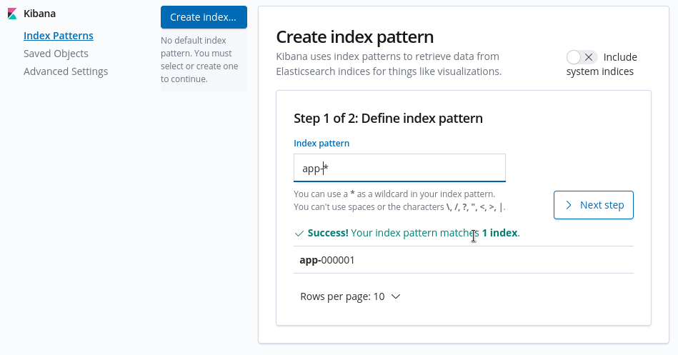
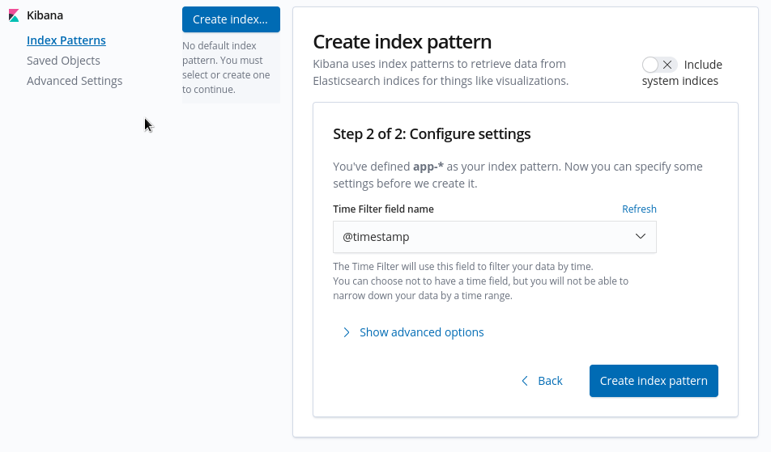

# OpenShift Logging Subsystem

## For Lokistack and Vector

- Provision an S3 bucket and specify its coordinates in `.env`
- In `deploy.sh` set `logging_stack=loki`
- Enable the console plugin in the OpenShift ClusterLogging resource.

## For ELK

- In `deploy.sh` set `logging_stack=elk`
- After install you must configure indices in Kibana as documented here: <https://docs.openshift.com/container-platform/4.12/logging/cluster-logging-deploying.html#cluster-logging-visualizer-indices_cluster-logging-deploying>, illustrations follow:

    
    

## Resources

- https://docs.openshift.com/container-platform/4.12/logging/cluster-logging.html
- https://loki-operator.dev/
- https://loki-operator.dev/docs/api.md/
- https://github.com/grafana/loki/tree/main/operator
